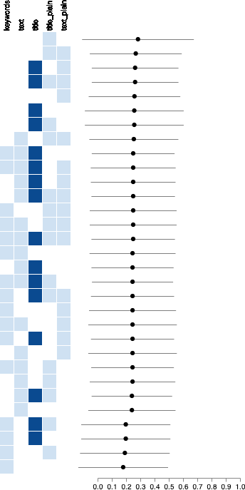
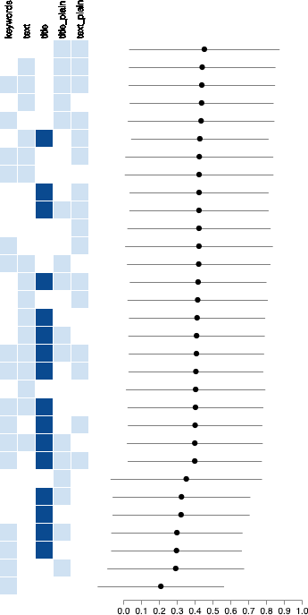
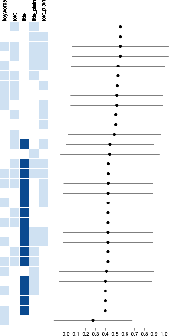
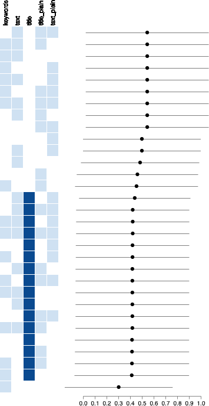

# Query rankings

This code generates visualizations to show how our search engine performs with different combinations of fields.

Currently (22 august 2019) we are using some simple query rankings to test the algorithms. They result in the following visualizations:

## Precision

## Discounted cumulative gain

## Expected reciprocal rank

## Mean reciprocal rank

